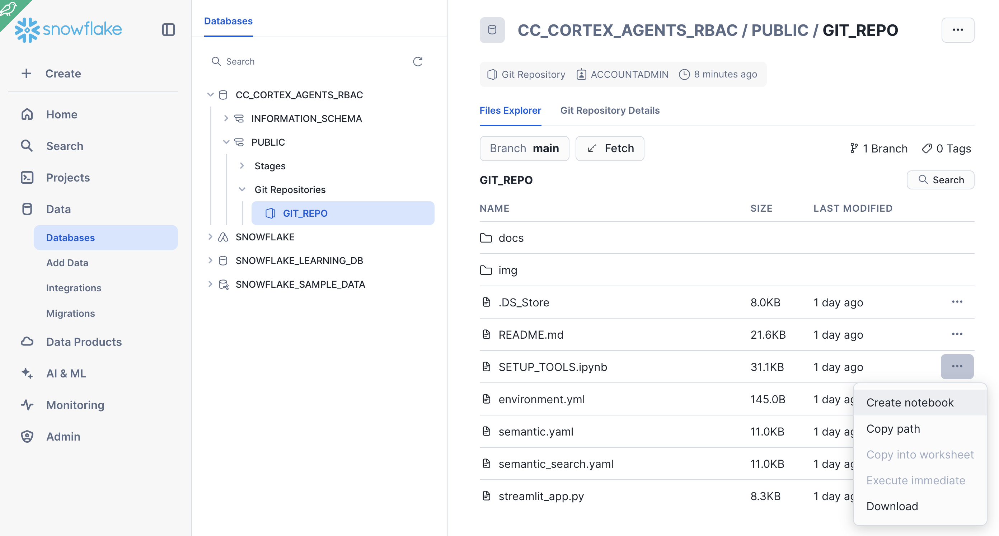
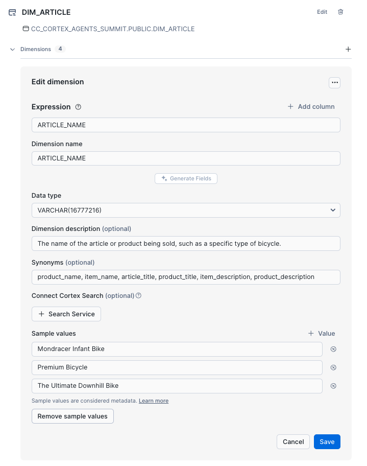
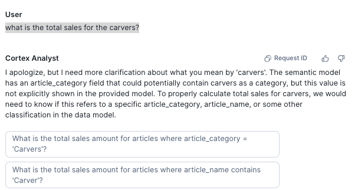
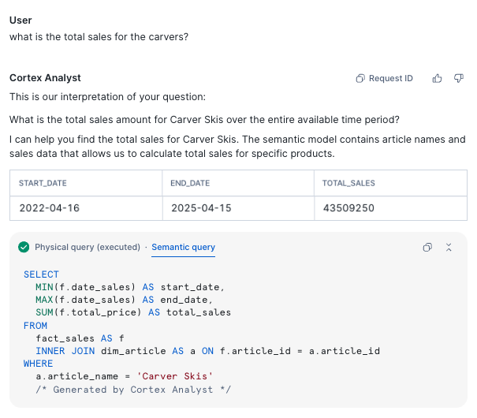
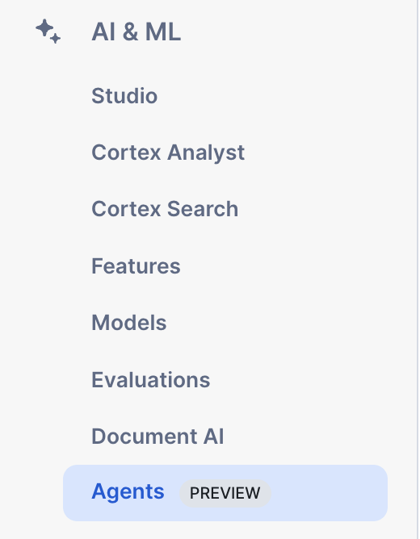
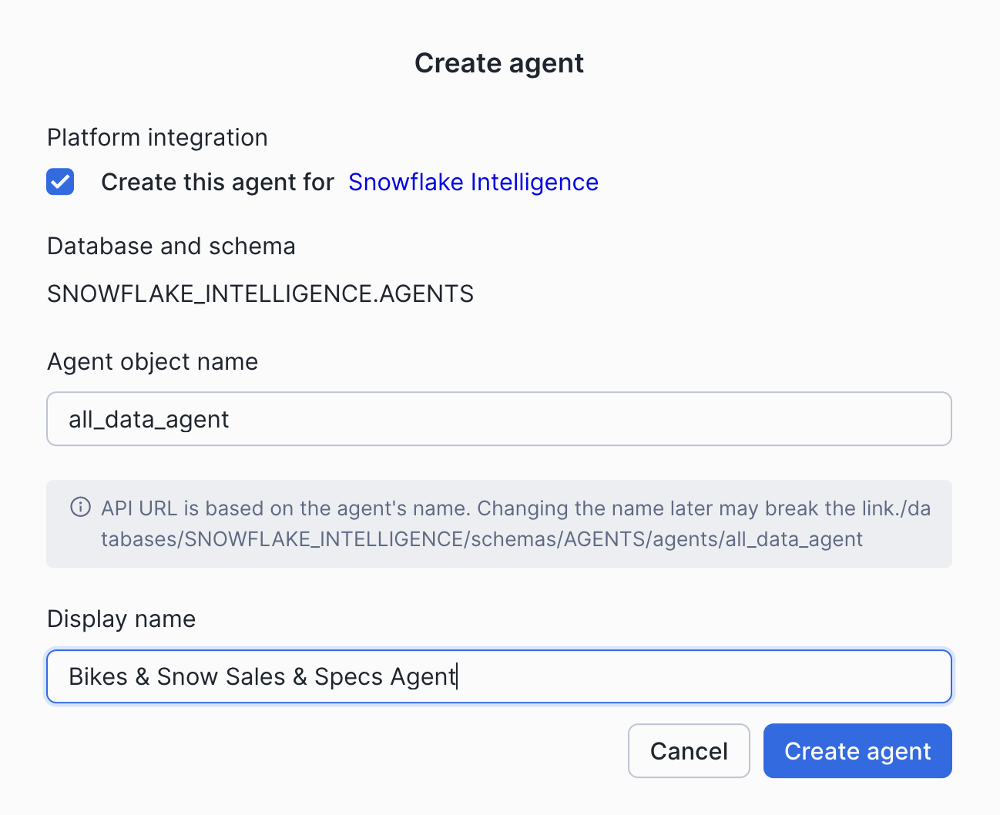
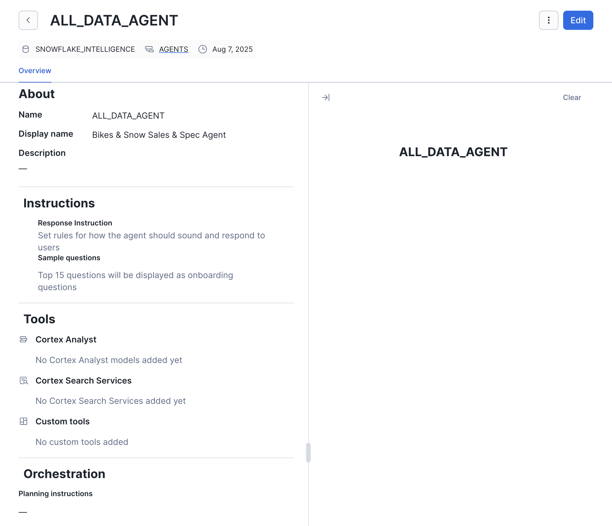
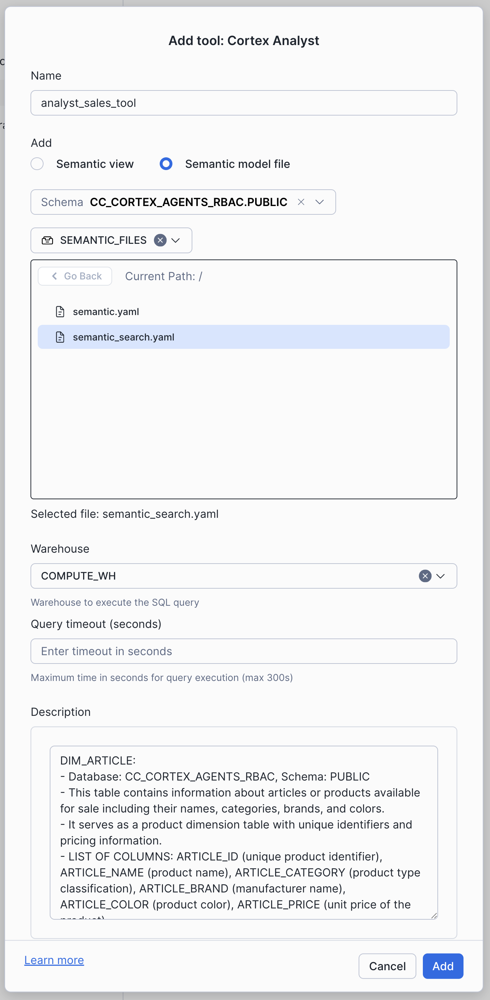
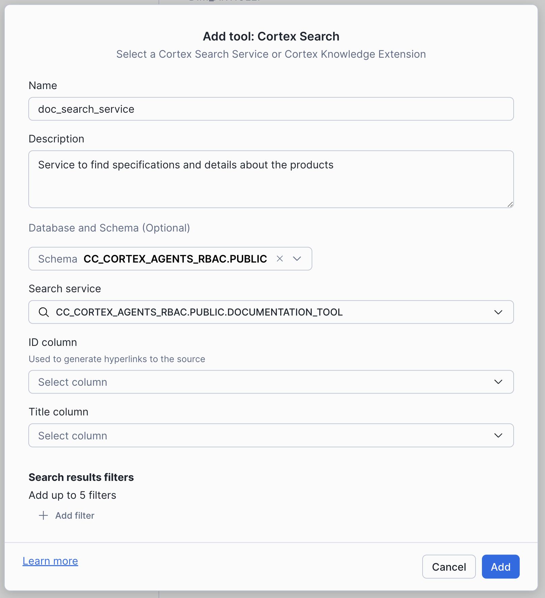
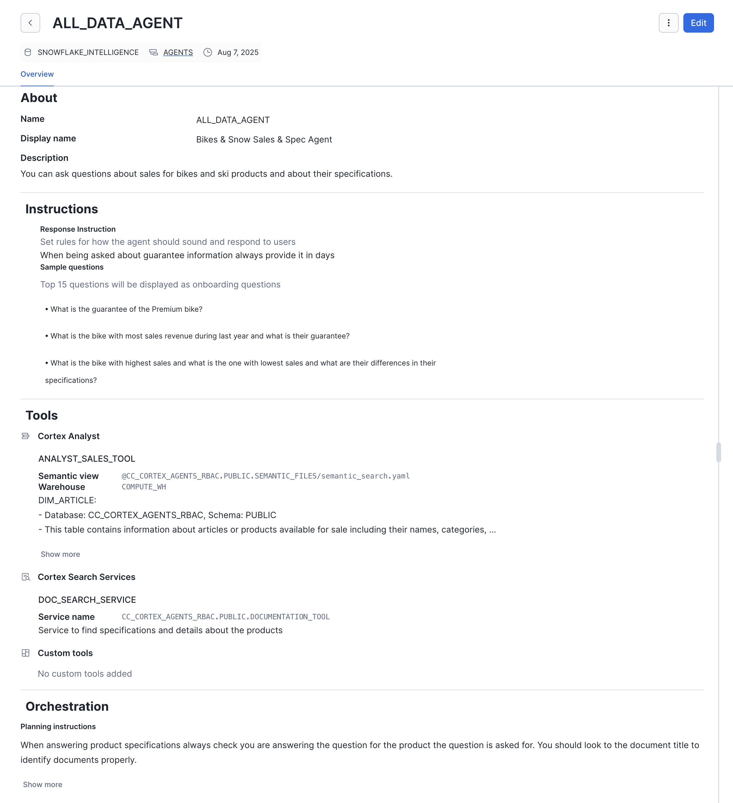

# Building Cortex Agents Hands-On Lab

This lab will explain step by step how to build a Data Agent using Snowflake Cortex Agents. You will be able to build a Data Agent that is able to use both Structured and Unstructured data to answer sales assistant questions.

First step will be to build the Tools that will be provided to the Data Agent in order to do the work. Snowflake provides two very powerful tools in order to use Structured and Unstructured data: Cortex Analyst and Cortex Search.

A custom and unique dataset about bikes and ski will be used by this setup, but you should be able to use your own data. This artificial dataset's goal is to make sure that we are using data not available on the Internet, so no LLM will be able to know about our own data.

The first step will be to create your own Snowflake Trial Account (our use the one provided for you during this hands-on lab). Once you have created it, you will be using Snowflake GIT integration to get access to all the data that will be needed during this lab.

## Step 1: Setup GIT Integration 

Open a Worksheet, copy/paste the following code and execute all. This will set up the GIT repository and will copy everything you will be using during the lab.

``` sql
CREATE or replace DATABASE CC_CORTEX_AGENTS_RBAC;

CREATE OR REPLACE API INTEGRATION git_api_integration
  API_PROVIDER = git_https_api
  API_ALLOWED_PREFIXES = ('https://github.com/ccarrero-sf/')
  ENABLED = TRUE;

CREATE OR REPLACE GIT REPOSITORY git_repo
    api_integration = git_api_integration
    origin = 'https://github.com/ccarrero-sf/cortex_agents_rbac';

-- Make sure we get the latest files
ALTER GIT REPOSITORY git_repo FETCH;

-- Setup stage for  Docs
create or replace stage docs ENCRYPTION = (TYPE = 'SNOWFLAKE_SSE') DIRECTORY = ( ENABLE = true );

-- Copy the docs for bikes
COPY FILES
    INTO @docs/
    FROM @CC_CORTEX_AGENTS_RBAC.PUBLIC.git_repo/branches/main/docs/;

ALTER STAGE docs REFRESH;

```

## Step 2: Setup Unstructured Data Tools to be Used by the Agent

We are going to be using a Snowflake Notebook to set up the Tools that will be used by the Snowflake Cortex Agents. Open the Notebook and follow each of the cells.

Select the Notebook that you have available in your Snowflake account within the Git Repositories:



Give the notebook a name and run it in a Container using CPUs.


you can run the entire Notebook and check each of the cells. This is the explanation for Unstructured Data section.

Thanks to the GIT integration done in the previous step, the PDF and IMAGE files that we are going to be using have already been copied into your Snowflake account. We are using two sets of documents, one for bikes and other for skis and images for both. 

Check the content of the directory with documents (PDF and JPEG). Note that this is an internal staging area but it could also be an external S3 location, so there is no need to actually copy the PDFs into Snowflake. 

```SQL
SELECT * FROM DIRECTORY('@DOCS');
```
### PDF Documents

To parse the documents, we are going to use the native Cortex [PARSE_DOCUMENT](https://docs.snowflake.com/en/sql-reference/functions/parse_document-snowflake-cortex). For LAYOUT we can specify OCR or LAYOUT. We will be using LAYOUT so the content is markdown formatted.

```SQL

CREATE OR REPLACE TEMPORARY TABLE RAW_TEXT AS
SELECT 
    RELATIVE_PATH,
    TO_VARCHAR (
        SNOWFLAKE.CORTEX.PARSE_DOCUMENT (
            '@DOCS',
            RELATIVE_PATH,
            {'mode': 'LAYOUT'} ):content
        ) AS EXTRACTED_LAYOUT 
FROM 
    DIRECTORY('@DOCS')
WHERE
    RELATIVE_PATH LIKE '%.pdf';

SELECT * FROM RAW_TEXT;
```

Next we are going to split the content of the PDF file into chunks with some overlaps to make sure information and context are not lost. You can read more about token limits and text splitting in the [Cortex Search Documentation ](https://docs.snowflake.com/en/user-guide/snowflake-cortex/cortex-search/cortex-search-overview)

Create the table that will be used by Cortex Search Service as a Tool for Cortex Agents in order to retrieve information from PDF and JPEG files. Note we are addig a USER_ROLE column that we are going to use to filter who can get access to that information:

```SQL
create or replace TABLE DOCS_CHUNKS_TABLE ( 
    RELATIVE_PATH VARCHAR(16777216), -- Relative path to the PDF file
    scoped_file_url VARCHAR(16777216),
    CHUNK VARCHAR(16777216), -- Piece of text
    CHUNK_INDEX INTEGER, -- Index for the text
    USER_ROLE VARCHAR(16777216), -- Role that can access to this row
    CATEGORY VARCHAR(16777216)
);
```

To split the text we also use the native Cortex [SPLIT_TEXT_RECURSIVE_CHARACTER](https://docs.snowflake.com/en/sql-reference/functions/split_text_recursive_character-snowflake-cortex). 

```SQL
-- Create chunks from extracted content
insert into DOCS_CHUNKS_TABLE (relative_path, chunk, chunk_index)

    select relative_path, 
            c.value::TEXT as chunk,
            c.INDEX::INTEGER as chunk_index
            
    from 
        raw_text,
        LATERAL FLATTEN( input => SNOWFLAKE.CORTEX.SPLIT_TEXT_RECURSIVE_CHARACTER (
              EXTRACTED_LAYOUT,
              'markdown',
              1512,
              256,
              ['\n\n', '\n', ' ', '']
           )) c;

SELECT * FROM DOCS_CHUNKS_TABLE;
```

As a demo, we are going to show how to use AI_CLASSIFY Cortex function to classify the document type. We have two classes: Bike and Snow, and we will pass the document title and the first chunk of the document to the function

```SQL
CREATE OR REPLACE TEMPORARY TABLE docs_categories AS WITH unique_documents AS (
  SELECT
    DISTINCT relative_path, chunk
  FROM
    docs_chunks_table
  WHERE 
    chunk_index = 0
  ),
 docs_category_cte AS (
  SELECT
    relative_path,
    TRIM(snowflake.cortex.AI_CLASSIFY (
      'Title:' || relative_path || 'Content:' || chunk, ['Bike', 'Snow']
     )['labels'][0], '"') AS CATEGORY
  FROM
    unique_documents
)
SELECT
  *
FROM
  docs_category_cte;
```

You can check the categories:

```SQL
select * from docs_categories;
```
Update the table and define what role can use each type of document:

```SQL
UPDATE docs_chunks_table dct
SET
    category = dc.category,
    USER_ROLE = CASE
                    WHEN dc.CATEGORY = 'Bike' THEN 'BIKE_ROLE'
                    WHEN dc.CATEGORY = 'Snow' THEN 'SNOW_ROLE'
                    ELSE NULL -- Or a default role if categories other than 'Bike' or 'Snow' are possible
                END
FROM
    docs_categories dc
WHERE
    dct.relative_path = dc.relative_path;
```
### IMAGE Documents

Now let's process the images we have for our bikes and skies. We are going to use AI_COMPLETE and AI_CLASSIFY multi-modal function asking for an image description and classification. We add it into the DOCS_CHUNKS_TABLE where we also have the PDF documentation. For AI_COMPLETE for Multi-Modal we are proposing claude-3-7-sonnet, but you should check what is the availability in your [region]( https://docs.snowflake.com/en/sql-reference/functions/ai_complete-single-file). 

We are goign to run the next cell first to enable [CROSS REGION INFERENCE](https://docs.snowflake.com/en/user-guide/snowflake-cortex/cross-region-inference). In our case, this is running within AWS_EU region and we want to keep it there. 

```SQL
ALTER ACCOUNT SET CORTEX_ENABLED_CROSS_REGION = 'AWS_EU';
```

```SQL
INSERT INTO DOCS_CHUNKS_TABLE (relative_path, scoped_file_url, chunk, chunk_index, category, USER_ROLE)
WITH classified_docs AS (
    SELECT
        RELATIVE_PATH,
        build_scoped_file_url(@docs, relative_path) as scoped_file_url,
        CONCAT('This is a picture describing: ' || RELATIVE_PATH ||
            ' .THIS IS THE DESCRIPTION: ' ||
            SNOWFLAKE.CORTEX.AI_COMPLETE('claude-3-5-sonnet',
            'This should be an image of a bike or snow gear. Provide all the detail that
            you can. Try to extract colors, brand names, parts, etc: ',
            TO_FILE('@DOCS', RELATIVE_PATH))) AS chunk,
        0 AS chunk_index,
        -- Calculate category once
        SNOWFLAKE.CORTEX.AI_CLASSIFY(
            TO_FILE('@DOCS', RELATIVE_PATH),
            ['Bike', 'Snow']):labels[0] AS category
    FROM
        DIRECTORY('@DOCS')
    WHERE
        RELATIVE_PATH LIKE '%.jpeg'
)
SELECT
    cd.relative_path,
    cd.scoped_file_url,
    cd.chunk,
    cd.chunk_index,
    cd.category,
    -- Use the calculated category to derive USER_ROLE
    CASE
        WHEN cd.category LIKE '%Bike%' THEN 'BIKE_ROLE'
        WHEN cd.category LIKE '%Snow%' THEN 'SNOW_ROLE'
        ELSE NULL -- Or a default role if categories other than 'Bike' or 'Snow' are possible
    END AS USER_ROLE
FROM
    classified_docs cd;
```

Check the descriptions created and that the Tool that will be used to retrieve information when needed:

```SQL
select * from DOCS_CHUNKS_TABLE
    where RELATIVE_PATH LIKE '%.jpeg';
```

At this point we should have only 2 roles. Check:

```SQL
select distinct(USER_ROLE) from DOCS_CHUNKS_TABLE;
```
### Setup Roles

We are going to have three different roles. One that can get access to only BIKE info, other to SNOW info and the third one that can access all. We also create three users:

```SQL
create role if not exists BIKE_ROLE;
create role if not exists SNOW_ROLE;
create role if not exists BIKE_SNOW_ROLE;

GRANT ROLE BIKE_ROLE TO ROLE ACCOUNTADMIN;
GRANT ROLE SNOW_ROKE TO ROLE ACCOUNTADMIN;
GRANT ROLE BIKE_SNOW_ROLE TO ROLE ACCOUNTADMIN;

CREATE USER IF NOT EXISTS bike_user PASSWORD = 'Password123!' DEFAULT_ROLE = BIKE_ROLE;
grant role BIKE_ROLE to user bike_user;

CREATE USER IF NOT EXISTS snow_user PASSWORD = 'Password123!' DEFAULT_ROLE = SNOW_ROLE;
grant role SNOW_ROLE to user snow_user;

CREATE USER IF NOT EXISTS all_user PASSWORD = 'Password123!' DEFAULT_ROLE = BIKE_SNOW_ROLE;
grant role BIKE_SNOW_ROLE to user all_user;
```

Grant each role to the current user:

```python
current_user = session.get_current_user()

for role in ['BIKE_ROLE', 'SNOW_ROLE', 'BIKE_SNOW_ROLE']:
    session.sql(f'grant role {role} to user {current_user}').collect()
```

### Enable Cortex Search Service

Now that we have processed the PDF and IMAGE documents, we can create a [Cortex Search Service](https://docs.snowflake.com/en/user-guide/snowflake-cortex/cortex-search/cortex-search-overview) that automatically will create embeddings and indexes over the chunks of text extracted. Read the docs for the different embedding models available.

When creating the service, we also specify what is the TARGET_LAG. This is the frequency used by the service to maintain the service with new or deleted data. Check the [Automatic Processing of New Documents](https://quickstarts.snowflake.com/guide/ask_questions_to_your_own_documents_with_snowflake_cortex_search/index.html?index=..%2F..index#6) of that quickstart to understand how easy is to maintain your RAG updated when using Cortex Search.

We also want to limit what documents can be accessed depending on the role being used. We have two options here, we could filter the role at the Agent level as user_role is being defined as one ATTRIBUTE, or we could filter when creating the service for each role. We are going to try this, where we keep one single table but create different Cortex Search Services depending on the role:

```SQL
create or replace CORTEX SEARCH SERVICE DOCUMENTATION_TOOL
ON chunk
ATTRIBUTES category, user_role
warehouse = COMPUTE_WH
TARGET_LAG = '1 hour'
EMBEDDING_MODEL = 'snowflake-arctic-embed-l-v2.0'
as (
    select chunk,
        chunk_index,
        relative_path,
        scoped_file_url,
        category,
        user_role
    from docs_chunks_table
);
```

One service for Bikes:

```SQL
create or replace CORTEX SEARCH SERVICE DOCUMENTATION_TOOL_BIKES
ON chunk
ATTRIBUTES category, user_role
warehouse = COMPUTE_WH
TARGET_LAG = '1 hour'
EMBEDDING_MODEL = 'snowflake-arctic-embed-l-v2.0'
as (
    select chunk,
        chunk_index,
        relative_path,
        scoped_file_url,
        category,
        user_role
    from docs_chunks_table
    where user_role = 'BIKE_ROLE'
);
```

And one service for Ski:

```SQL
create or replace CORTEX SEARCH SERVICE DOCUMENTATION_TOOL_SNOW
ON chunk
ATTRIBUTES category, user_role
warehouse = COMPUTE_WH
TARGET_LAG = '1 hour'
EMBEDDING_MODEL = 'snowflake-arctic-embed-l-v2.0'
as (
    select chunk,
        chunk_index,
        relative_path,
        scoped_file_url,
        category,
        user_role
    from docs_chunks_table
    where user_role = 'SNOW_ROLE'
);
```

Now we are going to grant access to those services to the different roles:

```SQL
USE ROLE ACCOUNTADMIN;

-- BIKE_ROLE:
GRANT OPERATE ON WAREHOUSE COMPUTE_WH TO ROLE BIKE_ROLE;
GRANT usage ON WAREHOUSE COMPUTE_WH TO ROLE BIKE_ROLE;

GRANT DATABASE ROLE SNOWFLAKE.CORTEX_USER TO ROLE BIKE_ROLE;

GRANT USAGE ON CORTEX SEARCH SERVICE DOCUMENTATION_TOOL_BIKES TO ROLE BIKE_ROLE;

--- SNOW_ROLE:
GRANT OPERATE ON WAREHOUSE COMPUTE_WH TO ROLE SNOW_ROLE;
GRANT usage ON WAREHOUSE COMPUTE_WH TO ROLE SNOW_ROLE;

GRANT DATABASE ROLE SNOWFLAKE.CORTEX_USER TO ROLE SNOW_ROLE;

GRANT USAGE ON CORTEX SEARCH SERVICE DOCUMENTATION_TOOL_SNOW TO ROLE SNOW_ROLE;

-- BIKE_SNOW_ROLE:

GRANT OPERATE ON WAREHOUSE COMPUTE_WH TO ROLE BIKE_SNOW_ROLE;
GRANT usage ON WAREHOUSE COMPUTE_WH TO ROLE BIKE_SNOW_ROLE;

GRANT DATABASE ROLE SNOWFLAKE.CORTEX_USER TO ROLE BIKE_SNOW_ROLE;

GRANT USAGE ON CORTEX SEARCH SERVICE DOCUMENTATION_TOOL TO ROLE BIKE_SNOW_ROLE;
```


If you have run these steps via the Notebook (recommended so you avoid copy/paste) you now have a cell for the the tool API.

After this step, we have one tool ready to retrieve context from PDF and IMAGE files.

## Step 3: Set Up Structured Data to be Used by the Agent
Another Tool that we will provide to the Cortex Agent will be Cortex Analyst, which will provide the capability to extract information from Snowflake Tables. In the API call we will provider the location of a Semantic file that contains information about the business terminology used to describe the data.

First we are going to create some synthetic data about the bike and ski products that we have.

We are going to create the following tables with content:

**DIM_ARTICLE – Article/Item Dimension**

Purpose: Stores descriptive information about the products (articles) being sold.

Key Columns:

    ARTICLE_ID (Primary Key): Unique identifier for each article.
    ARTICLE_NAME: Full name/description of the product.
    ARTICLE_CATEGORY: Product category (e.g., Bike, Skis, Ski Boots).
    ARTICLE_BRAND: Manufacturer or brand (e.g., Mondracer, Carver).
    ARTICLE_COLOR: Dominant color for the article.
    ARTICLE_PRICE: Standard unit price of the article.
    DIM_CUSTOMER – Customer Dimension

**DIM_CUSTOMER – Customer Dimension**

Purpose: Contains demographic and segmentation info about each customer.

Key Columns:

    CUSTOMER_ID (Primary Key): Unique identifier for each customer.
    CUSTOMER_NAME: Display name for the customer.
    CUSTOMER_REGION: Geographic region (e.g., North, South).
    CUSTOMER_AGE: Age of the customer.
    CUSTOMER_GENDER: Gender (Male/Female).
    CUSTOMER_SEGMENT: Marketing segment (e.g., Premium, Regular, Occasional).
    FACT_SALES – Sales Transactions Fact Table

**FACT_SALES – Sales Transactions Fact Table**

Purpose: Captures individual sales transactions (facts) with references to article and customer details.

Key Columns:

    SALE_ID (Primary Key): Unique identifier for the transaction.
    ARTICLE_ID (Foreign Key): Links to DIM_ARTICLE.
    CUSTOMER_ID (Foreign Key): Links to DIM_CUSTOMER.
    DATE_SALES: Date when the sale occurred.
    QUANTITY_SOLD: Number of units sold in the transaction.
    TOTAL_PRICE: Total transaction value (unit price × quantity).
    SALES_CHANNEL: Sales channel used (e.g., Online, In-Store, Partner).
    PROMOTION_APPLIED: Boolean indicating if the sale involved a promotion or discount.

You can continue executing the Notebook cells to create some syntetic data. 

First some data for articles:

```SQL
CREATE OR REPLACE TABLE DIM_ARTICLE (
    ARTICLE_ID INT PRIMARY KEY,
    ARTICLE_NAME STRING,
    ARTICLE_CATEGORY STRING,
    ARTICLE_BRAND STRING,
    ARTICLE_COLOR STRING,
    ARTICLE_PRICE FLOAT
);

INSERT INTO DIM_ARTICLE (ARTICLE_ID, ARTICLE_NAME, ARTICLE_CATEGORY, ARTICLE_BRAND, ARTICLE_COLOR, ARTICLE_PRICE)
VALUES 
(1, 'Mondracer Infant Bike', 'Bike', 'Mondracer', 'Green', 3000),
(2, 'Premium Bicycle', 'Bike', 'Veloci', 'Red', 9000),
(3, 'Ski Boots TDBootz Special', 'Ski Boots', 'TDBootz', 'White', 600),
(4, 'The Ultimate Downhill Bike', 'Bike', 'Graviton', 'Red', 10000),
(5, 'The Xtreme Road Bike 105 SL', 'Bike', 'Xtreme', 'Grey', 8500),
(6, 'Carver Skis', 'Skis', 'Carver', 'White', 790),
(7, 'Outpiste Skis', 'Skis', 'Outpiste', 'Grey', 900),
(8, 'Racing Fast Skis', 'Skis', 'RacerX', 'Grey', 950);
```

Here we are going to create a mapping table to define what ROLES can access what product categories.

```SQL
CREATE OR REPLACE TABLE ROW_ACCESS_MAPPING(
    ALLOWED_CATEGORY STRING,
    ALLOWED_ROLE STRING
);

INSERT INTO ROW_ACCESS_MAPPING (ALLOWED_CATEGORY, ALLOWED_ROLE)
VALUES
('Bike', 'BIKE_ROLE'),
('Ski Boots', 'SNOW_ROLE'),
('Skis', 'SNOW_ROLE'),
('Bike', 'BIKE_SNOW_ROLE'),
('Ski Boots', 'BIKE_SNOW_ROLE'),
('Skis', 'BIKE_SNOW_ROLE')
;
```

 We also define the Row Access Policies:

```SQL
CREATE OR REPLACE ROW ACCESS POLICY categories_policy
AS (ARTICLE_CATEGORY varchar) RETURNS BOOLEAN ->
    'ACCOUNTADMIN' = current_role()
    or exists(
        select * from ROW_ACCESS_MAPPING
            where allowed_role = current_role()
            and allowed_category = ARTICLE_CATEGORY
    );
```

Apply it to the DIM_ARTICLE table:

```SQL
ALTER TABLE DIM_ARTICLE
  ADD ROW ACCESS POLICY categories_policy
  ON (ARTICLE_CATEGORY);
```


Data for Customers:

```SQL
CREATE OR REPLACE TABLE DIM_CUSTOMER (
    CUSTOMER_ID INT PRIMARY KEY,
    CUSTOMER_NAME STRING,
    CUSTOMER_REGION STRING,
    CUSTOMER_AGE INT,
    CUSTOMER_GENDER STRING,
    CUSTOMER_SEGMENT STRING
);

INSERT INTO DIM_CUSTOMER (CUSTOMER_ID, CUSTOMER_NAME, CUSTOMER_REGION, CUSTOMER_AGE, CUSTOMER_GENDER, CUSTOMER_SEGMENT)
SELECT 
    SEQ4() AS CUSTOMER_ID,
    'Customer ' || SEQ4() AS CUSTOMER_NAME,
    CASE MOD(SEQ4(), 5)
        WHEN 0 THEN 'North'
        WHEN 1 THEN 'South'
        WHEN 2 THEN 'East'
        WHEN 3 THEN 'West'
        ELSE 'Central'
    END AS CUSTOMER_REGION,
    UNIFORM(18, 65, RANDOM()) AS CUSTOMER_AGE,
    CASE MOD(SEQ4(), 2)
        WHEN 0 THEN 'Male'
        ELSE 'Female'
    END AS CUSTOMER_GENDER,
    CASE MOD(SEQ4(), 3)
        WHEN 0 THEN 'Premium'
        WHEN 1 THEN 'Regular'
        ELSE 'Occasional'
    END AS CUSTOMER_SEGMENT
FROM TABLE(GENERATOR(ROWCOUNT => 5000));
```

And Sales data:

```SQL
CREATE OR REPLACE TABLE FACT_SALES (
    SALE_ID INT PRIMARY KEY,
    ARTICLE_ID INT,
    DATE_SALES DATE,
    CUSTOMER_ID INT,
    QUANTITY_SOLD INT,
    TOTAL_PRICE FLOAT,
    SALES_CHANNEL STRING,
    PROMOTION_APPLIED BOOLEAN,
    FOREIGN KEY (ARTICLE_ID) REFERENCES DIM_ARTICLE(ARTICLE_ID),
    FOREIGN KEY (CUSTOMER_ID) REFERENCES DIM_CUSTOMER(CUSTOMER_ID)
);

-- Populating Sales Fact Table with new attributes
INSERT INTO FACT_SALES (SALE_ID, ARTICLE_ID, DATE_SALES, CUSTOMER_ID, QUANTITY_SOLD, TOTAL_PRICE, SALES_CHANNEL, PROMOTION_APPLIED)
SELECT 
    SEQ4() AS SALE_ID,
    A.ARTICLE_ID,
    DATEADD(DAY, UNIFORM(-1095, 0, RANDOM()), CURRENT_DATE) AS DATE_SALES,
    UNIFORM(1, 5000, RANDOM()) AS CUSTOMER_ID,
    UNIFORM(1, 10, RANDOM()) AS QUANTITY_SOLD,
    UNIFORM(1, 10, RANDOM()) * A.ARTICLE_PRICE AS TOTAL_PRICE,
    CASE MOD(SEQ4(), 3)
        WHEN 0 THEN 'Online'
        WHEN 1 THEN 'In-Store'
        ELSE 'Partner'
    END AS SALES_CHANNEL,
    CASE MOD(SEQ4(), 4)
        WHEN 0 THEN TRUE
        ELSE FALSE
    END AS PROMOTION_APPLIED
FROM DIM_ARTICLE A
JOIN TABLE(GENERATOR(ROWCOUNT => 10000)) ON TRUE
ORDER BY DATE_SALES;
```

Assign those bojects to the roles we have created:

```SQL
-- BIKE_ROLE:

GRANT USAGE ON DATABASE CC_CORTEX_AGENTS_RBAC TO ROLE BIKE_ROLE;
GRANT USAGE ON SCHEMA PUBLIC TO ROLE BIKE_ROLE;
GRANT SELECT ON TABLE DIM_ARTICLE TO ROLE BIKE_ROLE;
GRANT SELECT ON TABLE DIM_CUSTOMER TO ROLE BIKE_ROLE;
GRANT SELECT ON TABLE FACT_SALES TO ROLE BIKE_ROLE;

--- SNOW_ROLE:

GRANT USAGE ON DATABASE CC_CORTEX_AGENTS_RBAC TO ROLE SNOW_ROLE;
GRANT USAGE ON SCHEMA PUBLIC TO ROLE SNOW_ROLE;
GRANT SELECT ON TABLE DIM_ARTICLE TO ROLE SNOW_ROLE;
GRANT SELECT ON TABLE DIM_CUSTOMER TO ROLE SNOW_ROLE;
GRANT SELECT ON TABLE FACT_SALES TO ROLE SNOW_ROLE;

-- BIKE_SNOW_ROLE:

GRANT USAGE ON DATABASE CC_CORTEX_AGENTS_RBAC TO ROLE BIKE_SNOW_ROLE;
GRANT USAGE ON SCHEMA PUBLIC TO ROLE BIKE_SNOW_ROLE;
GRANT SELECT ON TABLE DIM_ARTICLE TO ROLE BIKE_SNOW_ROLE;
GRANT SELECT ON TABLE DIM_CUSTOMER TO ROLE BIKE_SNOW_ROLE;
GRANT SELECT ON TABLE FACT_SALES TO ROLE BIKE_SNOW_ROLE;
```

You can switch the ROLE and test how RBAC works:

```SQL
USE ROLE SNOW_ROLE;
WITH yearly_sales AS (
  SELECT
    f.article_id,
    SUM(f.total_price) AS total_sales
  FROM
    fact_sales AS f
  WHERE
    DATE_PART('year', f.date_sales) = 2025
  GROUP BY
    f.article_id
)
SELECT
  a.article_name,
  a.article_category,
  a.article_brand,
  ys.total_sales
FROM
  yearly_sales AS ys
  INNER JOIN dim_article AS a ON ys.article_id = a.article_id
ORDER BY
  ys.total_sales DESC NULLS LAST
```

Switch back to the ACCOUNTADMIN ROLE you are using:

```SQL
use role ACCOUNTADMIN;
```


In the next section, you are going to explore the Semantic File. We have prepared two files that you can copy from the GIT repository:

```SQL
create or replace stage semantic_files ENCRYPTION = (TYPE = 'SNOWFLAKE_SSE') DIRECTORY = ( ENABLE = true );

COPY FILES
    INTO @semantic_files/
    FROM @CC_CORTEX_AGENTS_RBAC.PUBLIC.git_repo/branches/main/
    FILES = ('semantic.yaml', 'semantic_search.yaml');
```

Grant access to the semantic fole to the ROLES:

```SQL
GRANT READ, WRITE ON STAGE CC_CORTEX_AGENTS_RBAC.PUBLIC.SEMANTIC_FILES TO ROLE BIKE_ROLE;
GRANT READ, WRITE ON STAGE CC_CORTEX_AGENTS_RBAC.PUBLIC.SEMANTIC_FILES TO ROLE SNOW_ROLE;
GRANT READ ON STAGE CC_CORTEX_AGENTS_RBAC.PUBLIC.SEMANTIC_FILES TO ROLE BIKE_SNOW_ROLE;
```

## Step 4: Explore/Create the Semantic Model to be used by Cortex Analyst Tool

The [semantic model](https://docs.snowflake.com/en/user-guide/snowflake-cortex/cortex-analyst/semantic-model-spec) map business terminology to the database schema and adds contextual meaning. It allows [Cortex Analyst](https://docs.snowflake.com/en/user-guide/snowflake-cortex/cortex-analyst) generate the correct SQL for a question asked in natural language.

We have already provided a couple of semantic models for you to explore. 

### Open the existing semantic model

Under AI & ML -> Studio, select "Cortex Analyst"


Select the existing semantic.yaml file


### Test the Semantic Model

You can try some analytical questions to test your semantic file:

- What is the average revenue per transaction per sales channel?
- What products are often bought by the same customers?

### Cortex Analyst and Cortex Search Integration

We are going to explore the integration between Cortex Analyst and Cortex Search to provide better results. If we take a look at the semantic model, click on DIM_ARTICLE -> Dimensions and edit ARTICLE_NAME:

In the Dimension you will see that some Sample values have been provided:



Let's see what happens if we ask the following question:

- What are the total sales for the carvers?

You may have an answer like this:



Let's see what happens when we integrate the ARTICLE_NAME dimension with the Cortex Search Service we created in the Notebook (_ARTICLE_NAME_SEARCH). If you haven't run it already in the Notebook, this is the code to be executed:

```SQL
CREATE OR REPLACE TABLE ARTICLE_NAMES AS
  SELECT
      DISTINCT ARTICLE_NAME AS ARTICLE_NAME
  FROM DIM_ARTICLE;

CREATE OR REPLACE CORTEX SEARCH SERVICE _ARTICLE_NAME_SEARCH
  ON ARTICLE_NAME
  WAREHOUSE = COMPUTE_WH
  TARGET_LAG = '1 day'
  EMBEDDING_MODEL = 'snowflake-arctic-embed-l-v2.0'
AS (
  SELECT
       ARTICLE_NAME
  FROM ARTICLE_NAMES
);
```
In the UI:

- Remove the sample values provided
- Click on + Search Service and add _ARTICLE_NAME_SEARCH

It will look like this:


Click on save, also save your semantic file (top right) and ask the same question again:

- What are the total sales for the carvers?

Notice that now Cortex Analyst is able to provide the right answer because of the Cortex Search integration, we asked for "Carvers" but found that the correct article to ask about is "Carver Skis":



Now that we have the tools ready, we can create our first App that leverages Cortex Agents API.

## Step 5: Setup Snowflake Intelligence Agents

Now we have the tools that will be providing context to the Agents we are going to build. First let's create one Agent that will be able to answer questions about all our procucts, from sales to product specifications.

In Snowsight, on the left hand navigation menu, select AI & ML and Agents:



Click on Create agent.

The first agent, will be ablle to see all data, name it:



Click on the ALL_DATA_AGENT just created. 

We have now an empty agent where we are going to start adding instructions, tools to be used (all what we have already created), planning instructions and roles to be used:



Click on Edit.

- About: 

Here we have the name of the Agent the user is going to see and the description we want to provide.

- Instructions: 

Here you instruct the agent how to respond. Think about how you should teach an agent to do their work and what you expect. For example, we have information about guarantee of our products, but as it is in different formats, we are going to ask the Agent to always provide tha information in days:

"When being asked about guarantee information always provide it in days"

You can also provide some sample questions to help your users to use the Agent.

Some examples:

"What is the guarantee of the Premium bike?"
"What is the bike with most sales revenue during last year and what is their guarantee?"
"What is the ski product with highest sales and what is the one with lowest sales and what are their differences?"

- Tools: 

Here we are going to add the Cortex Analyst and Cortex Search Services we have already created. These are the powerful tools the Agent will be using to get context for the questions received.

Cortex Analyst: Select the semantic_search_yaml file, the warehouse that will be used to run the queries and provide a description of the tool. You can also generate the description with Cortex:



Cortex Search Service: Add a name, description and select the DOCUMENTATION_TOOL Service we had created before



- Orchestation: 

Here you can provide detailed instructions to the Agent about how to work. This is the place to teach your agent how to work and think. 

- Access:

Add the ROLES here that will be able to use this agent. For this one we are going to add the BIKE_SNOW_ROLE:


Finally click on Save.

Once you have configured your agent, you can test how it works before providing it to your users




